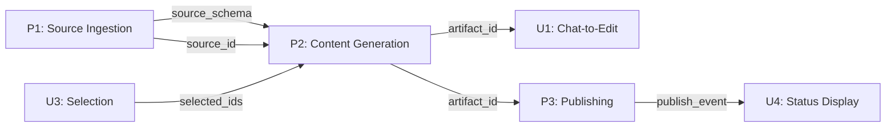

# Dependency Diagram

Visualization format for cross-pipeline dependencies.

## ASCII Diagram Format

```
┌─────────────────────────────────────────────────────────────┐
│                    PIPELINE DEPENDENCY MAP                   │
├─────────────────────────────────────────────────────────────┤
│                                                             │
│  P1 (Source Ingestion)                                      │
│    │                                                        │
│    ├──[source_schema]──► P2 (Content Generation)            │
│    │                       │                                │
│    └──[source_id]─────────►├──[artifact_id]──► U1 (Edit)    │
│                            │                    │           │
│                            └──[artifact_id]──► P3 (Publish) │
│                                                 │           │
│  U3 (Selection) ──[selected_ids]───────────────►│           │
│                                                 │           │
│                                                 └──► U4     │
│                                                             │
└─────────────────────────────────────────────────────────────┘
```

## Legend

```
P{N}  = Backend pipeline
U{N}  = UI pipeline
──►   = Data flow direction
[x]   = Data being passed
```

## Dependency Table Format

| ID | Type | From | To | Data | Failure Risk |
|----|------|------|----|----|--------------|
| X-001 | Data Handoff | P1 | P2 | source_schema | High |
| X-002 | Data Handoff | P2 | U1 | artifact_id | Medium |
| X-003 | Shared State | P2, U1 | - | artifact.content | High |
| X-004 | Context Sync | U3 | P2 | selected_ids | Medium |
| X-005 | Event Chain | P3 | U4 | publish_event | Low |

## Mermaid Format (if supported)



## Detailed Dependency Box

For complex dependencies, use expanded format:

```
┌─────────────────────────────────────────────────────────────┐
│  X-001: P1 → P2                                             │
├─────────────────────────────────────────────────────────────┤
│  Type: Data Handoff                                         │
│  Data: source_schema                                        │
│                                                             │
│  Flow:                                                      │
│    P1 writes source_schema to sources.schema                │
│    P2 reads sources.schema when building prompt             │
│                                                             │
│  Failure Modes:                                             │
│    X-001a: schema is null (S4-Blocking)                     │
│    X-001b: schema is stale (S1-Silent)                      │
│    X-001c: schema format changed (S3-Visible)               │
│                                                             │
│  Validation: ✗ No null check before use                     │
└─────────────────────────────────────────────────────────────┘
```

## Color Coding (for visual tools)

| Risk Level | Color | Meaning |
|------------|-------|---------|
| High | Red | Critical path, no fallback |
| Medium | Yellow | Has fallback but degraded |
| Low | Green | Optional, graceful handling |
